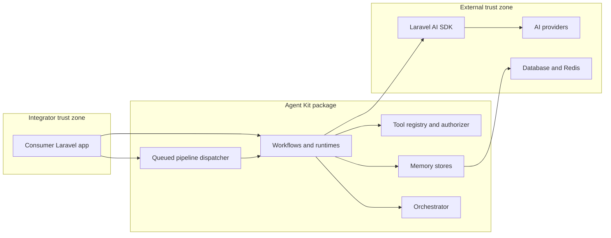

# Threat Model — Laravel AI Agent Kit

**Repository:** `creativecrafts/laravel-ai-agent-kit`  
**Date:** 2026-06-30  
**Model type:** Composer library (Laravel package) — runtime behavior depends on consuming applications  
**Validated context:** Integrator confirmed **library-only** usage with **mixed/unknown** data sensitivity and **unknown** internet exposure.

---

## Executive summary

Laravel AI Agent Kit is a **library**, not a network service. Its highest-risk themes are **integrator-controlled misuse surfaces**: passing untrusted paths/URLs into media DTOs, enabling tools or provider-native search without strong app-layer authorization, misconfiguring delegation or memory drivers, and queueing oversized or attacker-influenced pipeline payloads. The package mitigates several classes by default (deny-all tool authorization, encrypted persistent memory defaults, config fail-fast validation, SSRF/path guards on media DTOs, redacted telemetry). **Critical** issues in this model are conditional on consumer apps exposing workflows to untrusted users without wrapping Agent Kit with authentication, tenant isolation, and input policy. The highest-confidence **library-level** review targets are tool/provider authorization, media input factories, conversation memory and attachment replay, orchestration delegation, and queued pipeline serialization.

---

## Scope and assumptions

### In scope

- Runtime package code under `src/` (agents, orchestration, runtime, memory, tools, security, pipelines, modalities, blueprints, vectors)
- Published config `config/ai-agent-kit.php` and config validation (`ConfigValidator`)
- Package-owned queue jobs (`RunQueuedPipelineJob`, `PurgeExpiredConversationsJob`)
- Security documentation (`SECURITY.md`, `security_best_practices_report.md`)

### Out of scope

- Consuming Laravel application routes, auth, tenancy, WAF, infrastructure
- Laravel AI SDK provider implementations and third-party AI APIs (treated as external trust zone)
- CI/build pipelines (`.github/workflows`) except as supply-chain note
- Tests, examples, and scaffolding output under consumer `app/` trees
- IDE/agent skill artifacts (`.cursor`, `.claude`, etc.)

### Explicit assumptions

1. **Library-only deployment** — no single production topology; risk severity scales with how integrators expose Agent Kit.
2. **Mixed data sensitivity** — conversation content, attachments, and tool I/O may range from public to regulated; integrators must classify.
3. **Unknown internet exposure** — threats that require anonymous HTTP access are **conditional** and marked as integrator responsibility.
4. **Integrators use Laravel queue/database/redis** as documented; queue and DB ACLs are operator-controlled.
5. **Provider API keys** live in Laravel AI / app config, not in this package's repo.

### Open questions (would change ranking)

- Do any first-party integrators expose Agent Kit workflows on **unauthenticated** routes?
- Is **multi-tenant** isolation implemented in consuming apps (conversation IDs, vector namespaces, tool authZ)?
- Are **user-supplied URLs/files** passed into `EvaluationImageInput` / `TranscriptionAudioSource` without app-layer allowlists?

---

## System model

### Primary components

| Component | Role | Evidence |
|-----------|------|----------|
| **Consumer Laravel app** | HTTP/controllers, jobs, auth, tenancy (external) | README quick-start controller pattern |
| **Agent Kit facades / DI services** | Public workflow API (`TextToStructuredEvaluation`, `AgentKitManager`, runtimes) | `src/Blueprints/`, `src/LaravelAiAgentKitServiceProvider.php` |
| **SdkAiRuntime / modality runtimes** | Bridge to Laravel AI SDK for prompts, tools, attachments | `src/Core/Runtime/SdkAiRuntime.php`, `src/Core/Modality/` |
| **InMemoryToolRegistry** | Custom tool registration, JSON Schema validation, authorization | `src/Tools/InMemoryToolRegistry.php` |
| **ProviderToolMaterializer** | Opt-in provider-native tools (`web_search`, `file_search`, …) | `src/Tools/ProviderToolMaterializer.php`, `config/ai-agent-kit.php` |
| **Conversation stores** | Memory persistence (in-memory, database, redis) | `src/Memory/*ConversationStore.php` |
| **SynchronousAgentOrchestrator** | Multi-agent delegation with policy engine | `src/Core/Orchestration/` |
| **Queued pipeline dispatcher** | Serializes `RunContext` to queue workers | `src/Core/Pipeline/LaravelQueuedPipelineDispatcher.php` |
| **Security helpers** | Encryption, redaction, URL/path guards | `src/Security/` |
| **External AI providers** | OpenAI and others via `laravel/ai` | Composer dependency |

### Data flows and trust boundaries

- **Integrator app → Agent Kit API** — Prompts, `ExecutionRequest`, blueprints, media DTOs, tool names, provider profiles. Channel: in-process PHP calls. Guarantees: **none from package** (app must authenticate/authorize callers). Validation: JSON Schema for tools; config validation at boot; media DTO guards at construction.

- **Agent Kit → Laravel AI SDK → Provider** — Prompts, attachments, provider tool requests, API keys. Channel: HTTPS (SDK). Guarantees: provider credentials from Laravel config. Validation: package materializes only registered/authorized tools.

- **Agent Kit → Database / Redis** — Conversation messages, encrypted payloads, attachment ciphertext. Channel: Laravel DB/Redis drivers. Guarantees: AES encryption default for database/redis (`DatabaseConversationStore`, `RedisConversationStore`); app `APP_KEY` for Laravel encryption.

- **Agent Kit → Custom tool code** — Tool `execute()` with validated JSON input. Channel: in-process. Guarantees: `ToolAuthorizer` (default `DenyAllToolAuthorizer`).

- **Agent Kit → Local filesystem / URLs (media DTOs)** — Paths and URLs forwarded to SDK for transcription/image. Channel: file read / provider fetch. Guarantees: `SafeHttpUrlValidator`, `SafeLocalPathReferenceValidator`; optional `media_input.url_allowed_hosts`.

- **Queue producer → Queue worker (`RunQueuedPipelineJob`)** — Serialized PHP job with `RunContext`. Channel: Laravel queue backend. Guarantees: optional `payload_guard` size limit (default on).

#### Diagram

---

## Assets and security objectives

| Asset | Why it matters | Security objective (C/I/A) |
|-------|----------------|----------------------------|
| Provider API keys (via Laravel AI) | Cost abuse, data exfil to model vendor | C |
| Conversation content & attachments | User/tenant private data | C |
| Tool execution capability | Lateral movement into app systems | I, C |
| Agent delegation graph | Privilege escalation across agents | I |
| Vector store embeddings/documents | Retrieval leakage across tenants | C |
| `APP_KEY` / encryption at rest | Decrypts all stored conversations if leaked | C |
| Package config (`ai-agent-kit.php`) | Misconfiguration expands attack surface | I |
| Audit/telemetry events | Operational visibility; may leak metadata | C, I |
| Queue job payloads | May contain PII in `RunContext` | C |
| Build/package integrity (Packagist) | Supply-chain compromise | I |

---

## Attacker model

### Capabilities

- **Conditional (integrator-dependent):** Submit HTTP requests to consumer routes that call Agent Kit without adequate auth.
- **Conditional:** Influence `RunContext`, conversation IDs, media DTOs, or tool inputs if app passes user data through unchanged.
- **Conditional:** Trigger queued pipelines if app dispatches jobs from untrusted input.
- **Realistic for any deployment:** Abuse misconfigured provider tools, weak tool authorizers, or `dynamic_full_registry` delegation if enabled.
- **Realistic:** SSRF via URLs if app passes user URLs and allowlist/DNS guards are insufficient for threat model.
- **Infrastructure attacker:** Read Redis/DB backups if encryption off or keys compromised.

### Non-capabilities

- Cannot directly call Agent Kit without code running inside a Laravel app that registers the package.
- Cannot bypass default-deny tool execution without integrator replacing `ToolAuthorizer` and registering tools.
- Cannot alter package config validation at boot without config access or malicious deploy.
- Cannot directly open network listeners — package exposes no HTTP server.
- Cannot force provider tool enablement without config + runtime request naming those tools + authorizer approval.

---

## Entry points and attack surfaces

| Surface | How reached | Trust boundary | Notes | Evidence |
|---------|-------------|----------------|-------|----------|
| Blueprint / runtime invocation | Consumer controller, job, command calls package services | App → Agent Kit | Primary abuse path for prompt injection & data exfil | README `EvaluateSupportReplyController` |
| `ExecutionRequest` (prompt, tools, attachments, metadata) | App constructs request | App → Runtime | Metadata drives attachment replay mode | `src/Core/Runtime/ExecutionRequest.php` |
| Media DTO factories (`fromUrl`, `fromPath`, `fromUpload`, …) | App passes user content | App → Modality/Blueprint | SSRF / local read if misused | `EvaluationImageInput.php`, `TranscriptionAudioSource.php` |
| Custom tool execution | Model selects tool; registry executes | Runtime → Tool code | Default deny | `InMemoryToolRegistry::execute()` |
| Provider-native tools | Named in request + materialized | Runtime → Provider | Data leaves to third party | `ProviderToolMaterializer.php` |
| Agent orchestration / delegation | Agent returns delegate result | Agent → Agent | Policy modes restrict targets | `ConfigurableDelegationPolicyEngine.php` |
| Queued pipeline dispatch | App calls `QueuedPipelineDispatcher` | App → Queue → Worker | PHP serialization of `RunContext` | `RunQueuedPipelineJob.php` |
| Conversation memory read/write | `conversationId` + store driver | Runtime → DB/Redis | Cross-tenant if IDs guessable | `StoreBackedConversationContextManager.php` |
| Attachment replay | Continue conversation + metadata | Memory → Runtime | Provider refs opt-in default false | `AttachmentReplayPolicy.php` |
| Similarity search tool | Registered + authorized tool | Tool → Vector store | Namespace isolation is app concern | `src/Tools/SimilaritySearchTool.php` |
| Artisan scaffolding | `php artisan ai:make:*` | Dev machine only | Code generation, not runtime | `src/Scaffolding/` |
| Config boot validation | Service provider register | Deploy → Boot | Fail-fast on bad config | `ConfigValidator.php` |

---

## Top abuse paths

1. **Unauthorized tool invocation** — Attacker influences app to run agent with tool names → weak `ToolAuthorizer` → tool reads DB/files/API → sensitive data returned to model or user.

2. **Provider tool exfiltration** — App enables `web_search` / `file_search` + permissive authorizer → attacker prompt causes model to query external services with conversation context.

3. **Cross-tenant conversation access** — App uses predictable `conversationId` without authZ → attacker continues another user's conversation and replays attachments.

4. **SSRF via image/audio URL DTO** — App passes user URL to `fromUrl()` → provider or SDK fetches internal metadata URL → cloud credential theft (mitigated partially by `SafeHttpUrlValidator`; DNS rebinding remains integrator concern).

5. **Local file read via `fromPath()`** — App passes user-influenced path → SDK reads `/etc/passwd` or app secrets (path traversal blocked; absolute trusted paths still allowed by design).

6. **Delegation escape** — Misconfigured `dynamic_full_registry` + compromised agent → delegate to privileged agent → broader tool/memory access.

7. **Queue payload DoS** — App puts huge blobs in `RunContext` → large serialized jobs → worker memory exhaustion (mitigated by default `payload_guard`).

8. **Memory store compromise** — Redis/DB breached with `encrypt_payloads=false` or plaintext legacy keys → full conversation history readable.

9. **Prompt injection → downstream action** — Attacker content in prompt causes model to invoke allowed tools with malicious arguments (app-layer prompt injection; package executes authorized tools faithfully).

10. **Failover abuse / cost burn** — Attacker triggers repeated runtime failures → failover chain → elevated provider cost (budget enforcers partially limit).

---

## Threat model table

| Threat ID | Threat source | Prerequisites | Threat action | Impact | Impacted assets | Existing controls (evidence) | Gaps | Recommended mitigations | Detection ideas | Likelihood | Impact severity | Priority |
|-----------|---------------|---------------|---------------|--------|-----------------|------------------------------|------|-------------------------|-----------------|------------|-----------------|----------|
| TM-001 | Remote user via consumer app | App exposes agent workflow; weak/missing app auth | Invoke runtime with attacker-controlled prompt and tool list | Tool side effects, data exfil via model | Tool execution, conversation content | Default `DenyAllToolAuthorizer`; schema validation (`InMemoryToolRegistry`) | Package does not authenticate HTTP callers | Integrator: enforce authZ on every entrypoint; implement strict `ToolAuthorizer`; allowlist tool names per workflow | Log `ToolInvoked` / denied tool events; alert on new tool names | Medium (conditional) | High | **High** |
| TM-002 | Remote user | Provider tools enabled + authorizer allows | Model invokes `web_search`/`file_search` with sensitive context | Data sent to third-party search/index | Conversation content, provider keys | Opt-in config; separate `authorizeProviderTool()` | No package-level data classification | Keep provider tools disabled by default; per-tenant policy; audit `ExecutionRequest` provider tool names | Metrics on provider tool materialization | Low–Medium | High | **High** |
| TM-003 | Remote user | Predictable `conversationId`; missing tenant check | Continue victim conversation / replay attachments | Cross-user data disclosure | Conversation content, attachments | Encryption at rest; attachment replay off by default; deny lists | No built-in tenant isolation | Integrator: bind conversationId to user/tenant; authorize before continue; use random UUIDs | Alert on conversation access from new user context | Medium (conditional) | High | **High** |
| TM-004 | Remote user | App passes user URLs to media DTOs | Supply internal/metadata URL | SSRF, credential theft | Cloud metadata, internal services | `SafeHttpUrlValidator` + optional allowlist (`media_input.url_allowed_hosts`) | DNS rebinding; no fetch proxy in package | Integrator: allowlist domains; use signed object URLs; proxy fetches | Log rejected URL constructions; monitor provider fetch errors | Medium (conditional) | High | **High** |
| TM-005 | Remote user | App passes user input to `fromPath()` | Read sensitive local files via SDK | Local file disclosure | Host filesystem, secrets | Traversal/null-byte/`file://` blocked | Absolute paths still accepted | Never pass user input to `fromPath()`; use upload/storage | App-level path audit | Low–Medium (conditional) | High | **Medium** |
| TM-006 | Compromised/low-trust agent | `dynamic_full_registry` or broad allowlist enabled | Delegate to privileged agent | Agent privilege escalation | Orchestration integrity | Default `static_only`; `allow_dynamic_delegation` required | Misconfiguration risk | Keep static-only in production; code review config changes | Log delegation denials and successful delegations | Low | High | **Medium** |
| TM-007 | Remote user / operator mistake | Large `RunContext` enqueued | Dispatch oversized job | Worker DoS, queue backlog | Availability | `payload_guard` default true (`LaravelQueuedPipelineDispatcher`) | Integrator can disable guard | Size limits per workflow; strip blobs from queue payloads | Alert on payload guard exceptions | Low | Medium | **Low** |
| TM-008 | Infrastructure attacker | Redis/DB access | Read conversation payloads | Mass data breach | Conversation content | Encryption default; Redis wrapper format | Legacy plaintext read path; encrypt off | Run Redis migration runbook; enforce encrypt; rotate keys | Monitor decrypt failures; Redis key access audit | Low | High | **Medium** |
| TM-009 | Remote user (prompt injection) | Tools authorized for workflow | Manipulate model to call tools with attacker-chosen args | Integrity compromise via tools | Tool targets, app data | JSON Schema validation on tool input | Schema cannot block semantic abuse | Human-in-loop for sensitive tools; argument allowlists; least privilege tools | Anomaly detection on tool argument patterns | Medium (conditional) | Medium | **Medium** |
| TM-010 | Supply chain | Composer dependency compromise | Malicious package version installed | Full app compromise | Build integrity | `composer audit` clean; tagged releases | General OSS risk | Pin versions; verify signatures; dependabot | CI advisory scanning | Low | High | **Medium** |

---

## Criticality calibration

For **this library** under **integrator-unknown** exposure:

| Level | Meaning | Examples |
|-------|---------|----------|
| **Critical** | Unauthenticated remote abuse of library primitives leading to full tenant bypass or RCE | Only if integrator exposes runtimes without auth **and** enables dangerous tools/delegation — **conditional**, not intrinsic to package |
| **High** | Auth bypass at app layer, cross-tenant memory access, SSRF to metadata, provider exfil with sensitive data | TM-001–004 when consumer app is internet-facing |
| **Medium** | Misconfiguration (delegation, encryption off), prompt injection with limited tools, queue DoS | TM-005, TM-006, TM-008–010 |
| **Low** | Info leaks in redacted telemetry, debug guards left on in prod | Mis-set `debug_payload_guard` without production guard |

---

## Focus paths for security review

| Path | Why it matters | Related Threat IDs |
|------|----------------|-------------------|
| `src/Tools/InMemoryToolRegistry.php` | Tool input validation + authorization gate | TM-001, TM-009 |
| `src/Tools/DenyAllToolAuthorizer.php` | Default-deny posture | TM-001 |
| `src/Tools/ProviderToolMaterializer.php` | Provider-native tool gate | TM-002 |
| `src/Contracts/Tools/ToolAuthorizer.php` | Integrator extension point | TM-001, TM-002 |
| `src/Core/Runtime/SdkAiRuntime.php` | Main execution bridge, attachments, tools | TM-001, TM-003, TM-009 |
| `src/Core/Runtime/RuntimeConversationMemoryBridge.php` | Persistence + attachment replay | TM-003 |
| `src/Core/Runtime/AttachmentReplayPolicy.php` | Attachment rehydration rules | TM-003 |
| `src/Security/SafeHttpUrlValidator.php` | SSRF controls | TM-004 |
| `src/Security/SafeLocalPathReferenceValidator.php` | Path traversal controls | TM-005 |
| `src/Blueprints/EvaluationImageInput.php` | User media input surface | TM-004, TM-005 |
| `src/Core/Modality/TranscriptionAudioSource.php` | User media input surface | TM-004, TM-005 |
| `src/Core/Orchestration/ConfigurableDelegationPolicyEngine.php` | Delegation policy enforcement | TM-006 |
| `src/Memory/DatabaseConversationStore.php` | Encrypted persistence | TM-003, TM-008 |
| `src/Memory/RedisConversationStore.php` | Encrypted + legacy plaintext read | TM-008 |
| `src/Core/Pipeline/LaravelQueuedPipelineDispatcher.php` | Queue payload guard | TM-007 |
| `src/Core/Pipeline/Jobs/RunQueuedPipelineJob.php` | Deserialized worker entry | TM-007 |
| `src/Core/Config/ConfigValidator.php` | Fail-fast misconfiguration | TM-006, TM-007 |
| `config/ai-agent-kit.php` | Security defaults | TM-002, TM-006, TM-007 |
| `src/Tools/SimilaritySearchTool.php` | Vector retrieval exfil | TM-001 |
| `src/Security/DefaultRedactor.php` | Telemetry leakage | Low |

---

## Quality check

| Check | Status |
|-------|--------|
| All discovered entrypoints covered | Yes — runtime, tools, media DTOs, memory, orchestration, queue, scaffolding (dev) |
| Each trust boundary in threats | Yes — app→kit, kit→SDK, kit→stores, kit→tools, queue |
| Runtime vs CI/dev separated | Yes — CI out of scope; scaffolding noted as dev-only |
| User clarifications reflected | Yes — library-only, mixed sensitivity, unknown exposure → conditional severities |
| Assumptions and open questions explicit | Yes — see Scope section |

---

## Integrator security checklist (recommended)

1. Authenticate and authorize every call path into Agent Kit workflows.
2. Replace `DenyAllToolAuthorizer` with explicit policy; deny by default per workflow/tenant.
3. Keep provider-native tools disabled unless reviewed; audit `authorizeProviderTool()`.
4. Never pass user input to `fromPath()`; use upload/storage; configure URL allowlists for `fromUrl()`.
5. Bind `conversationId` to tenant/user; use unpredictable IDs.
6. Keep `static_only` delegation; require explicit opt-in for dynamic modes.
7. Keep memory encryption on; complete Redis plaintext migration if upgrading.
8. Keep `payload_guard` enabled; minimize serialized queue payloads.

---

*Generated from repository evidence and user-validated assumptions (2026-06-30). Revisit when first-party deployment patterns or tenancy model are known.*
