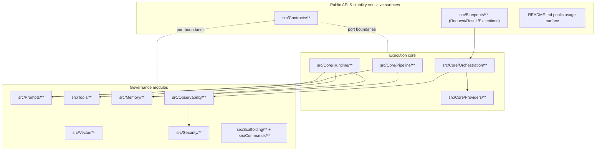
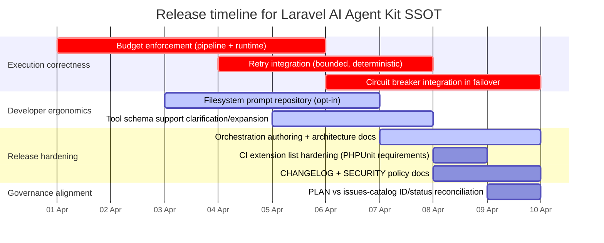

# Repository Audit Report for Laravel AI Agent Kit SSOT

## Executive summary

This audit covers the **SSOT unzipped from** `/mnt/data/laravel-ai-agent-kit-2026-04-01-05-43.zip`, assessed on **Wednesday 1 April 2026 (Europe/Stockholm)**. The repository is a Laravel 12+ package
that exposes pipeline orchestration, multi-agent orchestration, prompt/tool governance, memory, vector-store contracts, observability, security defaults, and scaffolding commands, while wrapping the
Laravel AI SDK behind package-owned contracts and DTOs. The Laravel AI SDK positioning aligns with the official SDK’s intended scope (providers, agents, tools, structured output, audio, vectors,
queues, and events). citeturn2search9turn2search2

Key readiness conclusions:

- The **core “must ship” capability set in `plan/SYSTEM-PROMPT.md` is largely implemented** in code and covered by deterministic tests (noting an environment prerequisite: PHPUnit requires the DOM
  extension, which must be enabled locally). citeturn3search5turn3search2turn2search7
- The most material **production gaps are “policy enforcement” gaps, not “surface area” gaps**: budgets are defined and validated but are not comprehensively enforced across pipeline and runtime;
  retry/circuit-breaker are present but not integrated into execution paths; prompt scaffolding generates filesystem prompts but the default prompt repository is in-memory only.
- Release-readiness work should prioritise: (a) **closing the enforcement loop** for budgets/retries/circuit-breaker; (b) **making prompt storage consistent** with the scaffolding and documentation; (
  c) **tightening release artefacts and governance** (CHANGELOG entries, doc completeness for orchestration authoring, and aligning the issue catalogue vs roadmap naming).

## SYSTEM-PROMPT objectives audit with repository evidence and scoring

The objectives below are taken from `plan/SYSTEM-PROMPT.md` (“Required Capabilities”, plus the non-negotiable architectural invariants). Each objective is mapped to concrete repository evidence (
files, tests, docs, config) and scored: **Not started / Partial / Mostly / Complete**.

### Objective mapping and scorecard

| Objective (SYSTEM-PROMPT)                                                                                                      | Current evidence in SSOT                                                                                                                                                                                                                                                                                                                                                                                                                                                                                                                                                                                                        |                                    Score | Concise justification                                                                                                                                                                                                                                                      |
|--------------------------------------------------------------------------------------------------------------------------------|---------------------------------------------------------------------------------------------------------------------------------------------------------------------------------------------------------------------------------------------------------------------------------------------------------------------------------------------------------------------------------------------------------------------------------------------------------------------------------------------------------------------------------------------------------------------------------------------------------------------------------|-----------------------------------------:|----------------------------------------------------------------------------------------------------------------------------------------------------------------------------------------------------------------------------------------------------------------------------|
| Blueprints and pipelines                                                                                                       | `src/Core/Pipeline/*` (`PipelineBuilder`, `RunContext`, `SynchronousPipelineRunner`, queued dispatcher/job); blueprints in `src/Blueprints/*` (`TextToStructuredEvaluation`, `AudioToTextToEvaluation` + agents + request/result DTOs); tests: `tests/PipelineRunnerTest.php`, `tests/QueuedPipelineDispatcherTest.php`, `tests/TextToStructuredEvaluationBlueprintTest.php`, `tests/AudioToTextToEvaluationBlueprintTest.php`; docs: `README.md` usage sections                                                                                                                                                                |                                   Mostly | Both flagship blueprints exist and are structured over orchestration; pipeline core exists with queue job; the remaining gap is enforcement (budgets/timeouts) and absence of an explicit streaming extension point (though the design does not inherently preclude one).  |
| Provider abstraction + failover + budgets + events                                                                             | Config: `config/ai-agent-kit.php` (`providers`, `default_provider`, `failover_order`, `budgets`); validation: `src/Core/Config/ConfigValidator.php`; providers: `src/Core/Providers/*` (`ConfiguredProviderRegistry`, `ConfiguredFailoverProviderSelector`, `ConfiguredAgentProviderProfileSelector`); events: `src/Observability/Events/ProviderFailoverResolved.php`; tests: `tests/ConfigValidatorTest.php`, `tests/FailoverProviderSelectorTest.php`, `tests/ProviderSelectionTest.php`                                                                                                                                     |       Mostly → Partial for “enforcement” | Provider registry/selection/failover exist and emit failover telemetry; budgets are validated and used in orchestration depth/step enforcement, but are not comprehensively enforced across pipeline execution, runtime token/cost ceilings, total timeout, or tool calls. |
| Prompt management (versioned templates; explicit variables)                                                                    | Prompt templates: `src/Prompts/PromptTemplate.php`; repository: `src/Prompts/InMemoryPromptRepository.php`; mapper: `src/Prompts/PromptExecutionMapper.php`; tests: `tests/PromptRepositoryTest.php`, `tests/PromptExecutionMapperTest.php`; CLI scaffolding: `src/Commands/MakePromptCommand.php`; docs in `README.md`                                                                                                                                                                                                                                                                                                         |                                   Mostly | Versioning and variable governance are implemented; the gap is that scaffolding writes filesystem prompts (`resources/prompts/...`) but the default repository is in-memory only (no packaged filesystem prompt loader).                                                   |
| Tool registry governance (allowlist; schema validation; authorisation hooks; CLI)                                              | Contracts: `src/Contracts/Tools/*`; default deny: `src/Tools/DenyAllToolAuthorizer.php`; registry: `src/Tools/InMemoryToolRegistry.php`; SDK tool bridging: `src/Tools/SdkToolMaterializer.php`; CLI scaffolding: `src/Commands/MakeToolCommand.php`; tests: `tests/ToolRegistryTest.php`, `tests/SdkToolMaterializerTest.php`                                                                                                                                                                                                                                                                                                  |                                   Mostly | Default-deny is strong; authoriser contract exists; validation is present but limited to a constrained “JSON-schema-like” type system (not full JSON Schema); provider-native tools can be enabled explicitly via config (`tools.provider_tools`).                         |
| Conversation memory (DB + ephemeral; retention; summarisation; encryption at rest)                                             | Contracts: `src/Contracts/Memory/*`; stores: `src/Memory/DatabaseConversationStore.php`, `src/Memory/InMemoryConversationStore.php`, `src/Memory/RedisConversationStore.php`; purge: `src/Memory/RetentionPurgeService.php`, `src/Memory/Jobs/PurgeExpiredConversationsJob.php`, command `src/Commands/PurgeConversationsCommand.php`; encryption: `src/Security/LaravelEncryptionService.php`; migrations stubs: `database/migrations/*.stub`; tests: `tests/DatabaseConversationStoreTest.php`, `tests/InMemoryConversationStoreTest.php`, `tests/RedisConversationStoreTest.php`, `tests/ConversationRetentionPurgeTest.php` |                                   Mostly | Meets the “one persistence + one ephemeral” baseline and retention + encryption; summarisation exists as a port and a safe no-op default (`NullConversationSummarizer`) rather than a real summariser.                                                                     |
| Observability (structured events; redaction-by-default)                                                                        | Pipeline events: `src/Observability/Events/Pipeline*`; orchestration events: `src/Observability/Events/Orchestration*`; runtime event normalisation: `src/Observability/SdkTelemetryNormalizer.php` with service provider listeners in `src/LaravelAiAgentKitServiceProvider.php`; redaction: `src/Security/DefaultRedactor.php`; tests: `tests/PipelineObservabilityTest.php`, `tests/OrchestrationObservabilityTest.php`, `tests/SdkTelemetryNormalizerTest.php`                                                                                                                                                              |                  Complete (for baseline) | Emits structured lifecycle events and normalises Laravel AI SDK events into package events while logging keys/counts/lengths rather than raw content by default (consistent with the privacy posture).                                                                     |
| Vector and retrieval (vector store port + at least one impl; phased adapters)                                                  | Contract: `src/Contracts/Vector/VectorStoreInterface.php`; in-memory: `src/Vector/InMemoryVectorStore.php`; strategy boundary: `src/Vector/SdkBackedVectorAdapterStrategy.php`; tests: `tests/InMemoryVectorStoreTest.php`, `tests/VectorStoreContractTest.php`, `tests/SdkBackedVectorAdapterStrategyTest.php`; config: `config/ai-agent-kit.php` (`vector`)                                                                                                                                                                                                                                                                   |                  Complete (for baseline) | Meets the “port + one implementation” requirement cleanly; additional adapters are intentionally deferred (consistent with roadmap).                                                                                                                                       |
| Security and compliance defaults (default deny tools; PII redaction utilities; never log secrets/raw content; retention hooks) | Default deny tools: `DenyAllToolAuthorizer`; redaction: `DefaultRedactor` (key-based redaction + length-based redaction of text); memory encryption: `LaravelEncryptionService` used by DB store; retention/purge: retention purger + job + command; redacted telemetry: SDK event normaliser and event payload shapes                                                                                                                                                                                                                                                                                                          |                                   Mostly | Strong defaults exist (deny-by-default tools; redacted telemetry); “PII redaction utilities” are minimal (key-pattern based) rather than content-aware; enforcement is mainly at the “do not log raw content” policy layer.                                                |
| Scaffolding (safe project inspection; generate; no overwrite unless flags)                                                     | Project inspection: `src/Scaffolding/ProjectInspector.php` (reads composer.json/lock; detects Laravel version; detects Laravel AI SDK presence); commands: `ai:make:tool`, `ai:make:prompt`, `ai:make:agent`, `ai:make:pipeline`; tests: `tests/ProjectInspectorTest.php`, command tests (`tests/MakeToolCommandTest.php`, etc.)                                                                                                                                                                                                                                                                                                |                                   Mostly | Safe scaffolding and `--force` overwrite guardrails exist; the main gap is aligning scaffold outputs with runtime defaults (notably prompts).                                                                                                                              |
| DDD-Lite boundaries + no vendor-type leakage in public API                                                                     | Modules: `src/Core`, `src/Contracts`, `src/Prompts`, `src/Tools`, `src/Memory`, `src/Resilience`, `src/Vector`, `src/Security`, `src/Observability`, `src/Scaffolding`; architecture tests: `tests/ArchTest.php` enforces no `Laravel\Ai` usage in public surfaces                                                                                                                                                                                                                                                                                                                                                              | Complete (for “no vendor leak” baseline) | The repository actively regression-guards against leaking SDK types into public contracts and blueprint/public modules via architecture tests.                                                                                                                             |

### Architectural diagram of the current “public boundary vs implementation” shape



This matches the intended “DDD-Lite ports and adapters” approach: public contracts isolate core and governance modules from swappable implementations, and explicit tests enforce the “no Laravel AI SDK
types in public contracts” boundary. citeturn2search9turn1search1

## Gaps to meet each objective and exact repository targets to change

This section lists what is still missing or inconsistent relative to the SYSTEM-PROMPT objectives, with **concrete files/tests/docs** to add or adjust. The items are ordered roughly by production
impact.

### Budget enforcement is declared but not comprehensively enforced

Budgets exist in config (`budgets.max_steps`, `max_tool_calls`, `max_total_timeout_seconds`, `max_tokens`, `max_cost_usd`), and are validated in `ConfigValidator`, but enforcement is only partial:
orchestration guards depth/step counts, while pipeline and runtime budgets are not systematically enforced (no global timeout envelope; no tool call ceiling; no token/cost ceiling). This is the single
largest “policy gap” against the SYSTEM-PROMPT’s “must enforce budgets” requirement.

Exact targets to add/fix:

- Add a **BudgetEnforcer** (or similarly named policy service) in `src/Resilience/` or `src/Core/` that can be used by both `SynchronousPipelineRunner` and `SdkAiRuntime` (or a wrapper around
  `AiRuntime`) to enforce: max steps, tool calls, total timeout, and token/cost ceilings.
- Update `src/Core/Pipeline/SynchronousPipelineRunner.php` to enforce `budgets.max_steps` and `budgets.max_total_timeout_seconds` (for pipeline runs) while preserving existing pipeline event emission.
- Add tests: a new `tests/PipelineBudgetEnforcementTest.php` (or extend `tests/PipelineRunnerTest.php`) to assert failure when budgets are exceeded; add similar tests for runtime token ceilings once
  implemented.
- Update docs: `README.md` “Configuration” section should explicitly state which budgets are currently enforced and which are planned, to avoid misrepresenting policy behaviour.

Risk: **High** (touches execution semantics). Regression safeguards: preserve current event payload shapes and ordering; preserve existing pipeline step execution ordering; ensure budget failure uses
typed exceptions so existing tests can match messages.

### Retry policy and circuit breaker exist but are not integrated into execution paths

The repository contains a retry policy resolver and circuit breaker manager (`src/Resilience/*`) and validates their config, but pipeline runner and runtime do not consume them; provider failover does
not consult circuit breaker state. This creates a mismatch between “policy surface exists” and “policy is actually applied”.

Exact targets to add/fix:

- Integrate retry policy into pipeline step execution: either in `SynchronousPipelineRunner` or in a new decorator/runner that wraps step execution with bounded retries (ensuring it honours
  `budgets.max_retries_per_step`, which is already enforced at the policy resolver layer).
- Integrate circuit breaker into provider selection/failover decisions: `ConfiguredFailoverProviderSelector` could consult `CircuitBreakerManager` to skip providers whose breaker is open, and emit a
  dedicated “provider skipped due to circuit breaker” event (new event type in `src/Observability/Events/`).
- Add tests: `tests/RetryPolicyResolverTest.php` exists; add a pipeline-level integration test to verify actual retry execution and that backoff is bounded; add failover test to verify breaker-driven
  provider skipping.

Risk: **High** (changes failover semantics and could change which providers are selected). Regression safeguards: require opt-in via config flags; default behaviour should remain current unless the
breaker integration is enabled.

### Prompt scaffolding outputs filesystem prompts, but default prompt repository does not load them

`ai:make:prompt` scaffolds prompt metadata and a markdown template under `resources/prompts/...`, but the default binding in `LaravelAiAgentKitServiceProvider` registers `InMemoryPromptRepository`
only. This is a **usability and correctness gap**: the scaffolding implies a filesystem-backed prompt repository, but the runtime does not ship one in this SSOT.

Exact targets to add/fix:

- Add a filesystem-backed prompt repository implementation, e.g. `src/Prompts/FilePromptRepository.php`, that loads prompt metadata and templates from `resources/prompts`.
- Add config that selects prompt repository driver (in-memory vs file), validated by `ConfigValidator`.
- Add tests: a new `tests/FilePromptRepositoryTest.php` that uses fixtures under `tests/Fixtures/prompts/...` to verify version selection, variable extraction, and missing variable errors.
- Update docs: `README.md` should explain how to load prompts from disk vs registering them in-memory, and how scaffolding relates to runtime.

Risk: **Medium** (new code path, but can be additive and non-breaking if kept opt-in). Regression safeguards: keep `InMemoryPromptRepository` as the default driver and preserve its current API and
behaviour.

### Tool “JSON schema validation” is implemented, but only for a constrained subset

The tool registry validates schema and input types, but it is not full JSON Schema support (it enforces a root object, flat properties, basic types, and optional additionalProperties). This is
acceptable as a baseline, but it should be clarified in documentation, or expanded to cover nested objects, arrays with item constraints, and richer validation.

Exact targets to add/fix:

- If the goal is full JSON Schema, introduce a dedicated schema validator dependency (with careful dependency minimisation) or implement a bounded subset explicitly documented as “supported schema”.
- Add tests that demonstrate nested object or array validation expectations, whichever direction is chosen.
- Update docs: clarify exactly what schema features are supported and how validation errors are reported.

Risk: **Medium** (tool validation affects runtime and security). Regression safeguards: preserve default-deny behaviour; preserve exception types and error formatting in `InvalidToolInputException`
and `InvalidToolSchemaException`.

### Issue governance metadata is inconsistent (PLAN vs issue catalogue numbering and status)

The roadmap uses “P1X-I11” naming in `plan/PLAN.md`, while `scripts/issues-catalog.json` uses “P10-I11” naming for the same title, and still labels flagship blueprint issues as `status:needs-spec`
even though code and tests exist. This will slow down release-hardening because it weakens “single source of truth” issue tracking.

Exact targets to add/fix:

- Decide on one canonical naming scheme (either update `plan/PLAN.md` to match `scripts/issues-catalog.json`, or regenerate catalogue from plan).
- Update the catalogue statuses for `TextToStructuredEvaluation` and `AudioToTextToEvaluation` issues to reflect implementation reality if acceptance criteria are met.
- Add a lightweight check script under `scripts/` that asserts catalogue and plan IDs match.

Risk: **Low** (docs/metadata only). Regression safeguards: none beyond careful review; keep titles stable.

## Prioritised, actionable checklist to reach production and release readiness

This checklist is structured as “what to do next” for release readiness, prioritised by impact and risk containment. It includes tests, PHPStan, Pest, CI, docs, security, telemetry, migrations, and
packaging.

### Priority actions

1. **Close the “policy enforcement loop”** (budgets + retries + breaker) by implementing budget enforcement and integrating retry/circuit breaker into runtime and/or pipeline execution paths, with
   opt-in config toggles and deterministic tests. This is the most material step toward predictable production behaviour.
2. **Make prompt storage consistent with scaffolding and documentation** by adding a filesystem-backed prompt repository (opt-in) or rewriting prompt scaffolding to target in-memory registration
   patterns (the former is typically more useful for packages).
3. **Strengthen release artefacts and operational docs**: complete `CHANGELOG.md`, add an “Operational Requirements” section to README (extensions required for tests; how to run CI locally), and
   publish multi-agent orchestration architecture/workflow authoring docs aligned with the package’s current orchestration model.
4. **Harden security posture and transparency** by documenting tool execution boundaries (package tools vs provider tools), adding explicit guidance on telemetry redaction defaults, and (optionally)
   adding `SECURITY.md` and a simple threat model note.
5. **Align governance metadata** (PLAN and issue catalogue IDs/statuses) so future audits and roadmapping remain coherent.

### Recommended changes with risk and regression safeguards

| Recommended change                                                                                       | Risk level | Regression safeguards                                                                                                                                                       |
|----------------------------------------------------------------------------------------------------------|-----------:|-----------------------------------------------------------------------------------------------------------------------------------------------------------------------------|
| Enforce pipeline budgets (`max_steps`, `max_total_timeout_seconds`) in `SynchronousPipelineRunner`       |       High | Keep step order and event emission identical; add dedicated exceptions for budget failures; add tests that prove existing success cases unchanged.                          |
| Enforce runtime budgets (`max_tokens`, `max_cost_usd`, tool call ceiling) in runtime bridge or a wrapper |       High | Make enforcement opt-in initially; ensure output schema unchanged; ensure telemetry remains redacted; add tests around token-count extraction and budget failure semantics. |
| Integrate retry policy into pipeline step execution                                                      |       High | Respect resolver’s bounded max retries; ensure backoff is deterministic in tests; preserve exception wrapping (`previous`) for diagnostics.                                 |
| Integrate circuit breaker into failover provider selection                                               |       High | Default to current behaviour unless explicitly enabled; add a new event for breaker-driven skipping; ensure failover tests cover both enabled and disabled paths.           |
| Add filesystem prompt repository to align with `ai:make:prompt` scaffold                                 |     Medium | Keep `InMemoryPromptRepository` as default; maintain identical `PromptRepository` contract; use fixtures to guarantee version/variable behaviour stays stable.              |
| Expand or precisely document tool schema support                                                         |     Medium | Preserve default deny; ensure validator never “accepts more” silently without tests; keep exception surface stable.                                                         |
| Add orchestration authoring and architecture documentation                                               |        Low | No behavioural change; keep README usage examples intact.                                                                                                                   |
| Update CI to include explicit required PHP extensions for PHPUnit                                        |        Low | Ensure extensions list matches official PHPUnit requirements (dom/xml/xmlwriter/mbstring etc.). citeturn3search5turn3search2                                            |
| Complete CHANGELOG and add SECURITY.md                                                                   |        Low | No behavioural change; keep release notes consistent with actual changes.                                                                                                   |

## Local commands, CI runbook, and DOMDocument troubleshooting

### Suggested local commands for quality gates

The repository already defines Composer scripts for analysis, tests, formatting, and CI-like runs. A pragmatic local workflow is:

```bash
# Install dependencies
composer install

# Static analysis (PHPStan/Larastan)
composer analyse
# or explicitly:
vendor/bin/phpstan analyse -c phpstan.neon.dist

# Unit/feature tests (Pest)
composer test
# or:
vendor/bin/pest

# Code style
composer pint
# or CI-like:
vendor/bin/pint --test

# Full “CI” script as defined in composer.json
composer ci
```

Notes:

- PHPStan is configured via `phpstan.neon.dist` (NEON format, “level: max”, and explicit include/exclude patterns). PHPStan expects either `phpstan.neon` or `phpstan.neon.dist` in the project root
  unless overridden. citeturn1search1
- The codebase uses Larastan to improve Laravel type inference, which is particularly relevant for container-resolved classes and framework “magic”. citeturn1search5
- Pest is the chosen test runner; it uses the `tests/` directory and a `Pest.php` bootstrap pattern consistent with Pest’s own conventions. citeturn0search4

### Running CI locally

If you want to execute GitHub Actions workflows locally, `act` (Docker-based) is the common approach; it reads workflows from `.github/workflows` and simulates a GitHub runner.
citeturn4search1turn4search7

Example workflow run:

```bash
# Run the default workflow locally (requires Docker)
act

# Run a specific workflow/job if needed
act -W .github/workflows/ci.yml -j checks
```

### DOMDocument issue: why it happens and how to fix it

If you see:

> `Class "DOMDocument" not found`

this is not a package bug; it is an environment prerequisite. PHPUnit relies on several PHP extensions, including `dom`, which is what provides `DOMDocument`. citeturn3search5turn2search7

The underlying facts:

- PHPUnit requires **dom/json/libxml/mbstring/xml/xmlwriter** extensions (and more depending on your setup). citeturn3search5turn3search2
- `DOMDocument` is part of PHP’s DOM extension family (commonly provided via OS packages that bundle DOM/XML modules). citeturn2search7turn2search8

Common fixes (choose what matches your OS and PHP installation method):

```bash
# Debian/Ubuntu (generic default PHP)
sudo apt-get update
sudo apt-get install php-xml

# If you run multiple PHP versions, install the matching version package
# (example: Debian/Ubuntu with PHP 8.3 installed via packages):
sudo apt-get install php8.3-xml
```

On Debian-family systems, `php-xml` / `php8.x-xml` packages provide DOM/XML-related modules. citeturn2search8turn2search0

Sanity check:

```bash
php -m | grep -E 'dom|xml|xmlwriter|mbstring'
php -r 'new DOMDocument(); echo "DOM OK\n";'
```

If the problem persists, the usual causes are:

- You installed the extension for a different PHP binary than the one running `vendor/bin/pest` (for example, Homebrew PHP vs system PHP, or Herd PHP vs CLI PHP).
- The extension is installed but not enabled in the active `php.ini`.
- You have multiple `php.ini` files and the CLI one differs from the FPM/web one (PHPUnit uses CLI).

## Mermaid timeline to production and release

The timeline below is a pragmatic sequence that matches the gap analysis: enforce policies first, align prompt storage next, then release artefacts and governance.



This plan deliberately front-loads “policy enforcement” because that is where production regressions tend to appear (silently exceeded budgets, runaway tool calls, and unbounded retries).